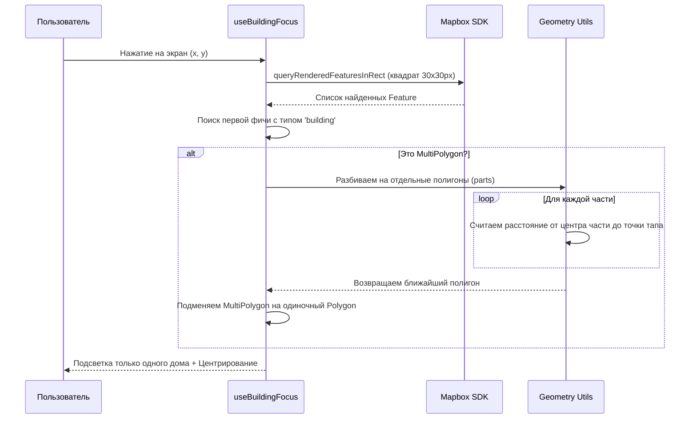

# Документация: Система фокусировки на зданиях (Mapbox + Expo)

## 1. В чем была проблема?

При реализации тапа по зданиям в стиле **OpenFreeMap Liberty** мы столкнулись с двумя фундаментальными проблемами:

1.  **Проблема «Квартальной подсветки» (MultiPolygons):**
    В современных векторных тайлах (OpenMapTiles/Planet) данные оптимизированы для скорости. Вместо того чтобы хранить каждый дом как отдельный объект, сотни соседних домов (например, частный сектор или корпуса одного ЖК) объединяются в одну геометрию — **MultiPolygon**.
    *   *Результат:* При тапе на один дом Mapbox возвращал объект, содержащий координаты еще 300 соседних домов. При попытке подсветить «выбранное здание» закрашивался сразу весь район.

2.  **Проблема «3D-смещения» (Perspective Tapping):**
    В 3D-режиме (pitch = 60°) визуальная модель здания сильно смещена относительно его реальных координат на земле (фундамента).
    *   *Результат:* Тап по крыше высокого здания часто не попадал в «фундамент» на карте, и запрос возвращал пустоту.

---

## 2. Как мы это решили (Архитектура решения)

### Схема работы системы

### Основные изменения:
*   **«Взрыв» MultiPolygon:** Мы внедрили логику перебора всех частей MultiPolygon. Теперь код математически вычисляет центр каждого дома в пачке и выбирает тот, который находится ближе всего к координатам пальца.
*   **Rectangle Query:** Мы заменили точечный поиск `queryAtPoint` на поиск в прямоугольнике `queryInRect` (30x30 пикселей). Это создало «зону допуска», позволяя ловить 3D-модели даже при небольшом промахе мимо фундамента.

---

## 3. Технические детали реализации

*   **Файл `building-focus.ts`**: Содержит логику фильтрации слоев (теперь мы ищем не только `building`, но и `fill-extrusion`).
*   **Файл `geometry.ts`**: Содержит функцию `getDistance`, используемую для поиска ближайшего строения в группе.
*   **Слой подсветки**: Используется `FillExtrusionLayer`, который динамически отрисовывается поверх выбранной геометрии, создавая эффект выделения 3D-объекта.

---

## 4. Оставшиеся проблемы (Roadmap)

Несмотря на успех, остаются два важных технических нюанса, которые нужно решить:

### Проблема А: «Пиксельное мерцание» при движении
**Симптом:** При перемещении или вращении камеры закрашенная область «глючит», дергается или на мгновение исчезает/накладывается сама на себя.
*   **Причина:** `FillExtrusionLayer` в Mapbox — это тяжелый шейдер. Когда мы передаем ему геометрию через `ShapeSource`, Mapbox пытается пересчитать освещение и тени для этого объекта на каждом кадре.
*   **Возможное решение:** Использование `setFilter` на основном слое зданий вместо создания нового `ShapeSource`. Это позволит использовать нативный движок отрисовки без создания «дубликата» геометрии.

### Проблема Б: Частичное закрашивание (Tile Clipping)
**Симптом:** Большие или сложные здания (например, длинные ТЦ или стадионы) закрашиваются не полностью — только та часть, которая попала в конкретный «тайл» (квадрат карты).
*   **Причина:** Векторные тайлы разрезают большие объекты по границам квадратов. `queryRenderedFeatures` часто возвращает только «кусок» здания, который находится в текущем или соседнем тайле.
*   **Возможное решение:** 
    1.  Использование уникального идентификатора (`osm_id` или `id`) для поиска всех кусков этого здания в соседних тайлах.
    2.  Запрос полной геометрии через внешний API (Overpass API / OSM), если требуется идеальная точность для больших объектов.

